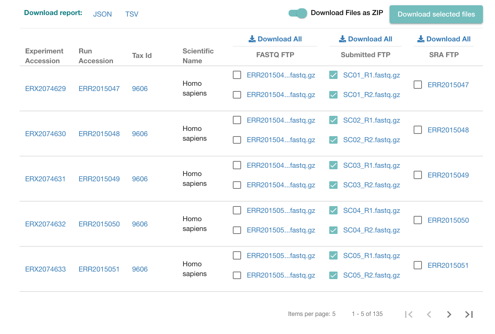

In this tutorial we will follow the DADA2 pipeline to go from raw sequencing reads to an ASV table, as well as how to do the taxonomic assignation of sequences. This hands-on largely follows the official [DADA2 tutorial](https://benjjneb.github.io/dada2/tutorial.html), but with some changes for our own data. 


```{r setup, include=FALSE}
# run this chunk to set up the packages needed for this tutorial

# install packages
knitr::opts_chunk$set(echo = TRUE)
packages_cran <- c("BiocManager", "ggplot2")
for(pkg in packages_cran){
    if(!pkg %in% installed.packages())
        install.packages(pkg)
}

packages_bioconductor <- c("dada2", "phyloseq")
for(pkg in packages_bioconductor){
    if(!pkg %in% installed.packages())
        BiocManager::install(pkg, update = F)
}

# make sure DADA2 package is at least v1.12 - otherwise update the package
if(packageVersion("dada2")<"1.12"){
    install.packages("dada2")
}


# load packages
library(dada2)
library(phyloseq)
library(ggplot2)
```


# Introduction

Short pptx presentation about the following topics:

- High-throughput 16S amplicon sequencing
- First preprocessing steps from the raw data: removal of primers, demultiplexing
- Differences between OTUs and ASVs
- Examples of pipelines to preprocess the data


# From the *.fastq files to the ASV table: using the DADA2 pipeline

The data that we will use was originally generated for the following publication: "[Quantitative microbiome profiling links gut community variation to microbial load](https://www.nature.com/articles/nature24460)".

In this article, the gut microbiome of 40 healthy adults was profiled via 16S sequencing, and absolute microbial loads per gram of stool were determined via flow cytometry. Here, we will reprocess the data using DADA2 for 20 of those healthy adults. Later in the course, I will also give a seminar on data normalization and why determining microbial loads is important in microbiome research.

To download the data, follow these steps:

1. Go to https://www.ebi.ac.uk/ena/browser/view/PRJEB21504
2. From the "Submitted FTP" column, select samples SC01 to SC20 (both R1 and R2 fastq files), you will need to go through the first 4 pages
3. Check that the option "Download files as zip" is active
4. Click on "Download selected files"
5. Move the "ena_files.zip" to the `data/` folder from the course and unzip.



Before starting, **unzip the `ena_files.zip` file located in the `data/` folder**

## Check that the files can be located properly

```{r files_checkup, include=T}
# When working with your own data, change the path to the directory containing your demultiplexed R1 and R2 fastq files
path <- "data/"
fastqseqs <- list.files(path, pattern = ".fastq.gz") # take only fastq files, ignore the other files
fastqseqs

# You should see a list of 40 files in the output
fastqseqs <- sort(fastqseqs) # Sort ensures forward/reverse reads are in same order (they should already be)
```


## Separate forward (R1) from reverse (R2) files and select sample names

```{r forward_reverse_reads_checkup, include=T}
# Make sure that R1 is for forward read and R2 for reverse! 
# In some sequencing protocols, the reads are reversed.
fnFs <- fastqseqs[grepl(".R1.fastq.gz", fastqseqs)] # Just select forward read files
fnRs <- fastqseqs[grepl(".R2.fastq.gz", fastqseqs)] # Just select reverse read files

# Get sample names from the first part of the forward read filenames
sample.names <- sapply(strsplit(fnFs, ".R1.fastq.gz"), `[`, 1) ## check if is 1 or 2!

# For the processing, get the full path to the files, not just the file names
fnFs <- file.path(path, fnFs)
fnRs <- file.path(path, fnRs)
```


## Inspect read quality profiles

```{r qc_rawreads, include=T}
plotQualityProfile(fnFs[1:2])
plotQualityProfile(fnRs[1:2]) 
```

The quality of the reverse read decays after ~130 bases, so we will trim it. This is normal for Illumina, so there's nothing to worry about.


## Filter and trim sequences

In some cases, the primers and other technical sequences are removed during the demultiplexing. In our experiment, this was not the case, so we will trim them together with the bad quality bases: we will remove the first 30 bases of both R1 and R2 to make sure we remove these sequences.

If in your data, the primers were removed during demultiplexing, there is no need to trim additional bases now.

The parameters indicated below match with the ones used in the original publication, but will largely depend on your data, and you will have to chose them based on the quality profiles 

```{r filter_trim, include=T}
# Place filtered files in filtered/ subdirectory in the data folder
filt_path <- file.path(path, "filtered") 

# Create names for the filtered files
filtFs <- file.path(filt_path, paste0(sample.names, "_F_filt.fastq.gz"))
filtRs <- file.path(filt_path, paste0(sample.names, "_R_filt.fastq.gz"))

# Filter - this takes ~2 min in a Macbook from 2015
out <- filterAndTrim(fnFs, # original forward files
                     filtFs, # filtered forward files
                     fnRs, # original reverse files
                     filtRs, # filtered reverse files
                     truncLen=c(200,140), # these settings are good for MiSeq (for our primer constructs)
                     trimLeft=c(30, 30), # trim the first bases (if low quality or if primers have not been removed)
                     maxN=0, # discard sequences with >0 Ns after truncation
                     maxEE=c(2,2), # discard reads with more than 2 Expected Errors (calculated from the quality score)
                     truncQ=11, # truncate reads when quality decreases below 11
                     rm.phix=TRUE, # removes traces of PhiX phage, used as internal control for sequencing
                     compress=TRUE, # compress the output
                     multithread=TRUE) # change to F if your computer does not have several cores you can use
head(out) 

# After filtering, we can check the quality of the filtered files to verify that we have solved the issues
plotQualityProfile(filtFs[1:2])
plotQualityProfile(filtRs[1:2])
```

Now we see that we effectively removed the low quality bases, especially in the reverse reads.


## Learn error rates

After the quality control of our data, the DADA2 pipeline requires the estimation of the error rates of this sequencing data. DADA2 will estimate what is the frequency of errors in our sequencing data, for instance of changing an "A" for a "G". This frequency will depend on the quality score, as we expect that with higher quality scores, there will be less chances of error.

Therefore, in the next step we will estimate error rates for both forward and reverse reads

**NOTE:** for speed reasons, the argument `nbases` for the `learnErrors` function is quite low in this tutorial, for real cases, it's better use the default (1e8)

```{r learn_errors, include=T}
# With nbases = 1e7; this takes ~2min to run in a Macbook from 2015
set.seed(12345)
# Learn forward error rates 
errF <- learnErrors(filtFs, nbases=1e7, multithread=TRUE) 
# Learn reverse error rates
errR <- learnErrors(filtRs, nbases=1e7,multithread=TRUE) 

# plot error rates
plotErrors(errF, nominalQ=TRUE)
```


## Sample inference 

After determining the error rates if the sequencers in our dataset, we are ready to implement the core function in the DADA2 denoising algorithm. The `dada` function uses the error estimates from the previous step to "predict" the original biological sequence that produced each read. This reduces a lot the number of different sequence variants in the dataset, as a single biological sequence can produce many different sequencing reads as a result of sequencing errors.

In previous DADA2 versions, there was a prior step of dereplication, i.e. collapse all the sequences that are identical to reduce computation time. As of v1.12, the dereplication step is included within the `dada` function, so it is not necessary to run it separately.

```{r dada, include=T}
# This part takes ~8 minutes in a macbook from 2015
dadaFs <- dada(filtFs, # the function will use the filtered files
               err=errF, # we pass on the calculated error rates
               multithread=TRUE # change if your computer does not allow multithreading
               )
dadaRs <- dada(filtRs, # the function will use the filtered files
               err=errR, # we pass on the calculated error rates
               multithread=TRUE # change if your computer does not allow multithreading
               )
```


## Merge forward and reverse reads

Before estimating taxonomy, we need to merge forward and reverse reads

```{r merge, include=T}
mergers <- mergePairs(dadaFs, filtFs, dadaRs, filtRs, verbose=TRUE)

# Inspect the merger data.frame from the first sample
names(mergers) <- sample.names
head(mergers[[1]])
```


## Construct sequence (ASV) table and remove chimeras

After merging forward and reverse reads, we construct a table that contains the info on the frequencies of each ASV in each of the samples analyzed. 

With this table, we can also remove chimeric reads. Chimeric sequences are identified if they can be exactly reconstructed by combining a left-segment and a right-segment from two more abundant “parent” sequences.

```{r make_asv, include=T}
seqtab <- makeSequenceTable(mergers)
dim(seqtab)

# Inspect distribution of sequence lengths
table(nchar(getSequences(seqtab)))

# Remove chimeras
seqtab.nochim <- removeBimeraDenovo(seqtab, method="consensus", multithread=TRUE, verbose=TRUE)

dim(seqtab.nochim)
sum(seqtab.nochim)/sum(seqtab)
```

About 80% of the reads remain after removing chimeras.


## Last checks: track reads throughout the DADA2 pipeline

As a last quality check of the DADA2 pipeline, we can track how many reads were lost at each of the steps we performed.

```{r track_reads, include=T}
getN <- function(x) sum(getUniques(x))
track <- cbind(out, sapply(dadaFs, getN), sapply(dadaRs, getN), sapply(mergers, getN),rowSums(seqtab.nochim))
colnames(track) <- c("input", "filtered", "denoisedF", "denoisedR", "merged", "nonchim")
rownames(track) <- sample.names
head(track)
```

We can see that there is no step that is causing a disproportionate reduction in the reads of the pipeline. 


# Assign taxonomy to the ASV table

After data cleaning and getting the denoised sequences, we can now assign the corresponding taxonomy. Different databases of taxonomic assignments of 16S sequences exist, here, we will use the RDP database. 

```{r assign_taxonomy, include=T}
# this step takes ~5 min on a macbook from 2015
taxHS <- assignTaxonomy(seqtab.nochim, # the ASV table
                        refFasta = "data/rdp_train_set_16.fa.gz",
                        tryRC = T,
                        multithread=TRUE)
```

The assignation with the RDP database (release 16) gives a taxonomic classification up to the genus level.
Since DADA2 attempts to elucidate the actual biological sequence producing the different sequencing reads, we can use this information to try to estimate taxonomy also at the species level.

```{r add_species, include=T}
# Add species
taxHS <- addSpecies(taxHS, "data/rdp_species_assignment_16.fa.gz", tryRC = T)

colnames(taxHS) <- c("Kingdom", "Phylum", "Class", "Order", "Family", "Genus", "Species")

# show taxonomy
unname(head(taxHS))
```

Now, we can write all the data generated to disk

```{r write_data, include=T}
# Write to disk
dir.create("output")
write.table(track, file = "output/track_reads.tsv", quote=FALSE, )
write.table(seqtab.nochim, file = "output/sequence_table_SV.tsv", quote=FALSE)
write.table(taxHS, file = "output/taxonomy_SV.tsv", quote=FALSE)
```


# Transfer data to phyloseq

In later tutorials in this course, we will manipulate and analyze data using different packages, one that is commonly used is phyloseq. So here, we will see how we can directly transfer the ASV abundances and taxonomic classification to phyloseq.

Phyloseq objects contain all the information about the 16S data, structured in 3 parts:
- otu_table (the table containing the frequencies of all OTUs or, in our case, ASVs)
- tax_table (the table with the taxonomic annotation)
- sample_data (metadata of the samples)

Here, we don't have sample metadata (such as patient BMI, sex or age), but we have the other two components, and we can build a phyloseq object with them:

```{r phyloseq_object, include=T}

ps <- phyloseq(otu_table(seqtab.nochim, taxa_are_rows = F),
               tax_table(taxHS))

ps
```

As a short example of what can be done with phyloseq, we will plot the relative abundances of the most abundant 15 genera in our samples:

```{r phyloseq_plot, include=T}
# first, we agglomerate the data at the genus level 
ps_genus <- tax_glom(ps, "Genus")

# select the top 15 genera 
top15 <- names(sort(taxa_sums(ps_genus), decreasing=TRUE))[1:15]

# calculate relative abundances
ps_genus <- transform_sample_counts(ps_genus, function(ASV) ASV/sum(ASV))

# group everything that's not in the top 15 as NA and plot
tax_table(ps_genus)[!rownames(tax_table(ps_genus)) %in% top15,"Genus"] <- NA
plot_bar(ps_genus, fill="Genus", title = "Top 15 taxa") 
```


